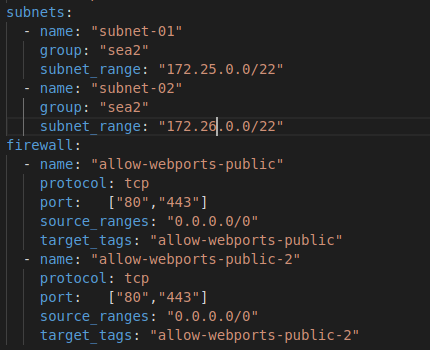

# Ansible-gce-network-simple
Network in gcp with simple topology. By default, the vpc will consists of one subnetwork and two firewalls rules. You can add more subnets and firewall by add or remove properties in the vars file like example below



Make sure you have no duplicate names or overlap IP segments when you edit that stuff.

# Requirements
When you use this ansible scripts, make sure you have installed all of these packages in advance on your ansible host:

- Python3
- Python3-pip
- Git

It's also necessary to install all of these packages requirements using pip:

- ansible==2.10
- requests>=2.18.4
- google-auth>=1.3.0
- docker>=1.8.0 
- boto
- boto3

Prepare all of neccesary files like serviceaccount, ssh keys, bash, ssl, etc. Recommended to place those files under directory called "files".

# How to use

```
ansible-playbook build-vpc.yml
```
