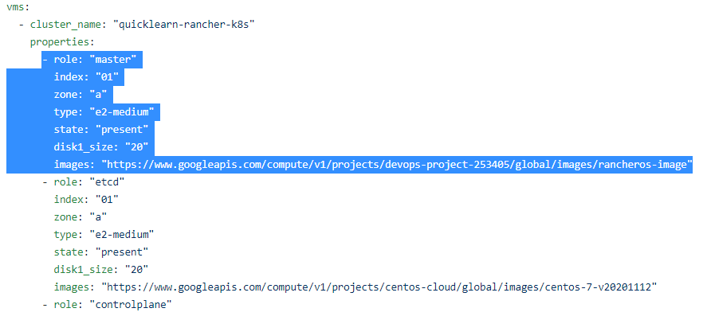

# ansible-gce-simple-cluster
Deploy three gcp compute engines using ansible 2.10. To use this scripts you need to make sure you have rancheros on your gce image collections because these scripts originally used as preliminary scripts for deploying simple kubernetes cluster with rancher2 as container management tools. If you haven't, you can follow the intructions [here](https://github.com/rvn40/instructions/blob/main/rancheros/upload-image-to-gcp.md) to import rancheros image. 

However, you can also use these scripts to launch three nodes without any purpose for build kubernetes cluster with rancher2 by deleting and modifying some vm properties in vars file. See the picture below.

No matter on which purpose you have, when you willing to running these scripts you have to make sure that vpc, subnetworks, and firewall rules has been existed and configured in advance before we start to deploy all resources by using these scripts as well as configure the ansible hosts properly and install some packages you need like below.

### Note

> Just in case you need the example of ansible script for build the vpc, subnetworks, and firewall rules can be found [here](https://github.com/rvn40/ansible-gce-network-simple). 

# Requirements
When you use this ansible scripts, make sure you have installed all of these packages in advance on your ansible host:

- Python3
- Python3-pip
- Git

It's also necessary to install all of these packages requirements using pip:

- ansible==2.10
- requests>=2.18.4
- google-auth>=1.3.0
- docker>=1.8.0 
- boto
- boto3

Prepare all of neccesary files like serviceaccount, ssh keys, bash, ssl, etc. Recommended to place those files under directory called "files".

# How to use