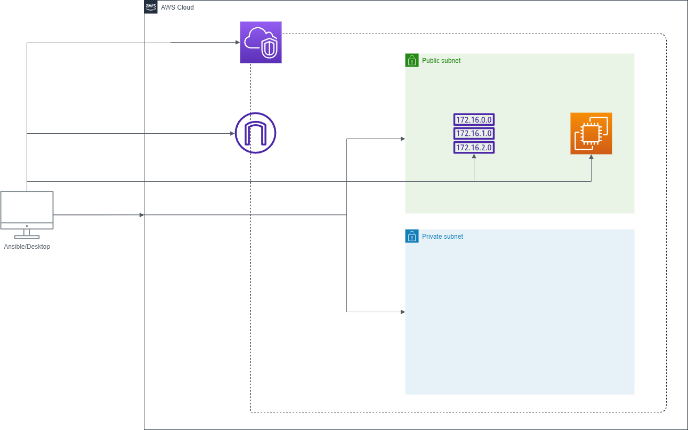

# PDSO-Challenge-01
The exam test for recruitment process at Practical DevSecOps.

# Design



# Prerequisite
You need to prepare following components:
- AWS account
- Private key for ssh connection store at "files/secrets/" directory
- AWS_ACCESS_KEY and AWS_SECRET_KEY with proper IAM roles

# Usage
Below is the command to running this ansible playbook:

```
ansible-playbook playbook.yaml -i hosts --extra-vars "AWS_ACCESS_KEY=<your-own-access-key> AWS_SECRET_KEY=<your-own-secret-key>"
```